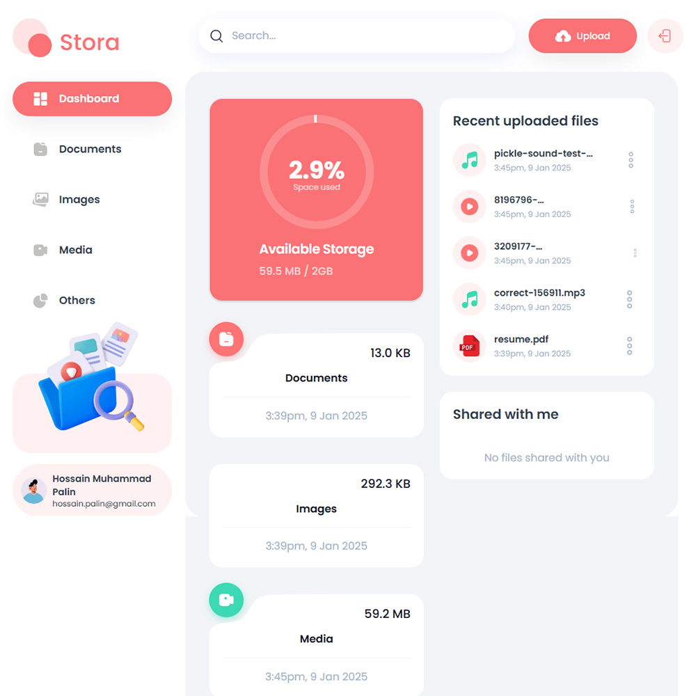

# Stora - Storage Management System

Stora is a storage management system that allows users to store and manage their files in a secure and organized manner. It is a web application that provides users with a simple and intuitive interface for uploading, downloading, and organizing their files.

## Requirements

- Basic HTML, CSS & Javascript knowledge.
- Basic React JS knowledge.
- Basic React Hooks knowledge.
- Basic Next JS knowledge.

## How to Install & Run

To run the application, follow these steps:

1. Clone the repository or download it as a ZIP file.
2. In a terminal, navigate to the folder where the application is located.
3. Run the **npm install** command to install all the necessary dependencies.

```shell
npm install
```

4. Run the **npm run dev** command to start the application in development mode.

```shell
npm run dev
```

5. Open your browser and navigate to **http://localhost:3000** to use the application.

```shell
http://localhost:3000
```

## Application Features

Stora offers the following features to help users manage their files effectively and efficiently in a digital storage system:

#### 1. Efficient Storage Organization
- Custom Categories: Users can create and manage custom storage categories for better organization.
- Item Tagging: Easily tag items with keywords to enable quick search and identification.
- Folder-Like Structure: Supports nested structures to mimic physical storage organization digitally.

#### 2. Advanced Search Functionality
- Real-time Search: Search for items or categories instantly with smart suggestions.
- Filter and Sort Options: Narrow down results by tags, date, or category.

#### 3. User Authentication and Data Security
- Secure Login: Appwrite handles secure user authentication, including options for social login and email/password authentication.
- Role-Based Access Control (RBAC): Assign different access levels to users, ensuring data privacy and security.

#### 4. File Management System
- File Upload and Download: Users can upload and retrieve files easily.
- Preview Feature: Preview files such as images, PDFs, and documents directly within the app.
- Drag-and-Drop Uploads: Intuitive drag-and-drop feature for file handling.

## Technologies Used

A powerful React-based framework for building server-rendered and static web applications using Next.js. It is a production-ready framework that allows developers to create dynamic web applications using server-side rendering (SSR) and static site generation (SSG).

#### 1. Next.js
A powerful React-based framework for building server-rendered and static web applications, Next.js offers the following benefits:

- Server-Side Rendering (SSR): Improves SEO and performance by rendering pages on the server.
- Static Site Generation (SSG): Allows pre-rendering of pages at build time for faster delivery.
- API Routes: Provides built-in support for creating backend APIs without the need for a separate server.
- Routing System: Simplified routing with file-based conventions.
- Image Optimization: Automatically optimizes images for faster loading.
- Scalability: Excellent for handling complex, large-scale applications with high traffic.

#### 2. Appwrite
Appwrite is an open-source backend-as-a-service platform that simplifies backend development with features such as:

- Authentication: Secure user authentication with support for email/password, OAuth, and JWT tokens.
- Database Management: Offers a powerful and flexible database for structured data storage.
- File Storage: Handles file uploads, storage, and retrieval with customizable access controls.
- Real-Time Functionality: Enables real-time data sync and collaboration across multiple users.
- Custom Functions: Allows developers to write and deploy server-side functions for advanced logic.
- Webhooks: Triggers custom workflows on specific actions like user signups or file uploads.

#### 3. Tailwind CSS
A highly customizable CSS framework for building modern, responsive designs:

- Utility-First Approach: Provides pre-built utility classes for styling directly in the markup.
- Responsive Design: Makes it easy to build layouts that adapt to various screen sizes.
- Custom Themes: Developers can define custom colors, fonts, and components for a consistent design system.
- Performance: Removes unused styles during production builds, reducing CSS file size.
- Flexibility: Allows rapid prototyping and iteration with minimal overhead.

#### 4. Other Supporting Technologies
- TypeScript: Enhances JavaScript with static typing, ensuring fewer runtime errors and improving developer productivity.
- Vercel (Deployment): Used for hosting and deployment, offering features like continuous integration, automatic scaling, and global content delivery.
- Git and GitHub: For version control and collaboration, ensuring codebase integrity and tracking changes.
- PostCSS: Handles advanced CSS transformations and optimizations during the build process.

## Contribution

If you'd like to contribute to this project, feel free to submit a pull request. Before doing so, be sure to create a separate branch for your changes.

## Buy A Coffee

Like my works and want to support me?

<a href="https://www.buymeacoffee.com/hossainpalin" target="_blank"></a>

## Screenshots



## Live demo

Live previews are the best way for a better understanding of the application's user interface.

[Click here...](url)
